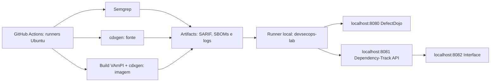

# DevSecOps - VAmPI | UNIFOR

Repositorio: https://github.com/jandersonsiqueira/trabalho-final-unifor

Trabalho final da disciplina de DevSecOps da UNIFOR. A pipeline analisa o VAmPI com Semgrep, gera inventarios de dependencias com cdxgen e centraliza os resultados no DefectDojo e no Dependency-Track.

O GitHub Actions executa as analises do codigo-fonte e da imagem Docker. Os dois SBOMs ficam em projetos separados no Dependency-Track, permitindo comparar as dependencias declaradas com os componentes presentes na imagem. A arquitetura, os resultados e a triagem dos achados estao documentados em [docs/RELATORIO.md](docs/RELATORIO.md).

## Arquitetura



O runner hospedado pelo GitHub nao consegue acessar o localhost do seu computador. A solucao usa os runners do GitHub para analisar o VAmPI e um **runner self-hosted instalado diretamente no mesmo computador do Docker** apenas para os uploads. Ele recebe os artifacts por conexoes de saida ao GitHub. Nao exige tunel, dominio, abertura de portas no roteador ou servidor publico. Mac e Linux sao suportados pelos scripts de upload.

Como o repositorio e publico, o workflow nao executa em pull requests; uploads so ocorrem em disparo manual na branch padrao, por colaboradores autorizados. O runner local deve ser temporario (`--ephemeral`), registrado somente para a execucao revisada e encerrado depois de um job. Ele nao constroi nem executa o VAmPI. Secrets sao disponibilizados apenas no passo de upload correspondente. Nao habilite gatilhos de pull request para esse runner; para uso recorrente, prefira um repositorio privado.

Os servicos publicam portas somente em `127.0.0.1`. A API vulneravel nao e iniciada: sua imagem e construida e inspecionada. Dados persistem em volumes Docker. O Compose e um laboratorio local, com banco embarcado do Dependency-Track, nao uma configuracao de producao.

## Ferramentas e arquivos

| Item | Versao / papel |
| --- | --- |
| VAmPI | Commit `f16052dce83f05847133ec98f01c5193a41de7d8` do repositorio oficial |
| Semgrep | `1.177.0`, regras `auto`, SARIF nativo |
| cdxgen | `12.8.4`, CycloneDX 1.6, imagens oficiais |
| DefectDojo | `3.3.100`, importacao SARIF via API v2 |
| Dependency-Track | `4.14.4`, API e frontend |
| GitHub Actions | Scans em Ubuntu 24.04; uploads em runner local |

```text
.github/workflows/devsecops.yml  Pipeline com passos visiveis
config/tools.env                Versoes e commit do alvo
docker-compose.yml              Servicos de gestao locais
scripts/init_env.py             Credenciais locais aleatorias
scripts/setup_local.py          Cadastro inicial de projetos e chaves via API
scripts/prepare.sh              Checkout do VAmPI fixado
scripts/scan.sh                 Comandos SAST / SCA / build
scripts/validate_report.py      Validacao estrutural dos resultados
scripts/upload.py               Clientes das APIs, sem secrets no codigo
tests/                         Testes de falhas e contratos de integracao
docs/RELATORIO.md               Relatorio tecnico e analise dos achados
docs/VALIDACAO.md               Testes, resultados e pendencias
reports/                       Resultados locais, ignorados pelo Git
.work/                         VAmPI e ambientes temporarios, ignorados
```

O commit do alvo e as versoes dos scanners sao fixos. O ruleset `auto`, a imagem base do Dockerfile original e dependencias transitivas sem lock podem mudar entre execucoes. Os artifacts e o ID da imagem permitem identificar cada analise. O codigo original do VAmPI foi preservado.

## Pre-requisitos

- Docker Desktop / Docker Engine iniciado, com Compose v2.
- Git, Bash e Python 3.10 ou superior. Nao e necessario instalar Node ou Semgrep no host.
- Internet para GitHub, registries, PyPI e bases de vulnerabilidades.
- Para o laboratorio completo, reserve pelo menos 8 GB ao Docker e espaco para varios GB de imagens; 12 GB ou mais facilita a sincronizacao inicial. O Dependency-Track esta limitado a 3 GB neste laboratorio pequeno.
- Repositorio GitHub com Actions habilitado e permissao para cadastrar runner e Secrets.

## Subir DefectDojo e Dependency-Track

Na raiz do projeto:

```bash
python3 scripts/init_env.py
docker compose config --quiet
docker compose up -d
docker compose ps -a
docker compose logs -f initializer
```

O inicializador aplica migracoes e deve terminar com codigo 0. Na primeira inicializacao isso leva alguns minutos. Saia da visualizacao de logs com Ctrl+C; os servicos continuam executando.

| Servico | Endereco | Login inicial |
| --- | --- | --- |
| DefectDojo | http://localhost:8080 | Usuario `admin`; senha gerada em `DD_ADMIN_PASSWORD` no arquivo local `.env` |
| Dependency-Track | http://localhost:8082 | Credencial de fabrica informada pela documentacao oficial; no primeiro login, altere a senha |
| Dependency-Track API | http://localhost:8081 | Destino da API Key, nao e a interface de login |

A credencial de fabrica do Dependency-Track e usuario `admin` e senha `admin`. Ela pertence ao produto e deve ser trocada no primeiro acesso; nenhuma credencial de integracao e fixada no codigo. O gerador do `.env` nunca sobrescreve senhas existentes. Nao publique `.env`, chaves ou prints que as revelem.

### Configuracao inicial assistida

Com as duas plataformas prontas, este assistente substitui os cadastros manuais das secoes seguintes:

```bash
python3 -m venv .venv
.venv/bin/python -m pip install -r requirements.txt
.venv/bin/python scripts/setup_local.py
docker compose restart dtrack-apiserver
```

Na primeira execucao, informe a senha de fabrica do Dependency-Track quando solicitada, sem eco no terminal. O assistente troca essa senha por um valor aleatorio salvo em `DTRACK_ADMIN_PASSWORD` no `.env`, cria o Product/Engagement do Dojo, os dois projetos no Dependency-Track e um time com `BOM_UPLOAD` e `VIEW_PORTFOLIO`. Salva URLs, IDs e chaves em `.env.integrations`, com permissao 0600 e ignorado pelo Git. Se esse arquivo ja existir, nao altera a configuracao. O bootstrap do Dojo usa o token do administrador local; para uso continuado substitua por um usuario dedicado ao Product.

O assistente tambem habilita o OSV para PyPI. O reinicio acima inicia a primeira sincronizacao; aguarde sua conclusao e reenvie os SBOMs para reavaliar os componentes. Outras fontes e ecossistemas podem ser habilitados no painel. Se a instalacao ja tiver configuracoes diferentes ou ACL personalizada, use os passos manuais abaixo. O assistente e destinado ao Compose novo deste projeto, nao a uma plataforma compartilhada.

Para subir somente uma plataforma:

```bash
docker compose up -d dojo celeryworker celerybeat
docker compose up -d dtrack-apiserver dtrack-frontend
```

## Preparar DefectDojo

1. Entre em http://localhost:8080 com a senha do `.env`.
2. Em Products, crie um Product Type `Academico`, caso necessario, e o Product `VAmPI`.
3. Dentro do Product, crie um Engagement `DevSecOps UNIFOR`, tipo CI/CD, com datas que incluam a execucao.
4. Anote o ID numerico do Engagement, disponivel na URL ou na API. Nao confunda com Product ID.
5. Obtenha o token em seu menu de usuario, **API v2 Key**. Para uso continuado, prefira usuario dedicado com permissao de importacao no Product.
6. Configure `DOJO_API_KEY` como Secret e `DOJO_ENGAGEMENT_ID` como Variable no GitHub.

A importacao usa `scan_type=SARIF`, e nao `Semgrep JSON Report`. O cliente consulta os Tests do Engagement: usa `/api/v2/import-scan/` na primeira execucao e `/api/v2/reimport-scan/` com o Test ID nas seguintes. O titulo e fixo: `VAmPI - Semgrep SARIF`. Depois da primeira importacao, pode fixar `DOJO_TEST_ID` para identificar explicitamente o destino. O Test deve pertencer ao Engagement e ao mesmo parser/ferramenta.

Os findings chegam ativos e **nao verificados**: um resultado automatico nao e uma confirmacao humana. Nao fechamos achados antigos automaticamente. Uma execucao parcial nao deve ser interpretada como correcao. Consulte o contrato da instalacao em `/api/v2/oa3/swagger-ui/`.

## Preparar Dependency-Track

1. Entre em http://localhost:8082 e troque a senha inicial.
2. Crie o projeto `VAmPI`, versao `fonte`, e o projeto `VAmPI`, versao `imagem`.
3. Copie o UUID de cada projeto. Use UUIDs diferentes.
4. Em Administration > Access Management > Teams, crie `GitHub Actions` e conceda `BOM_UPLOAD` e `VIEW_PORTFOLIO`.
5. Gere uma API Key para esse time. Se ACL estiver habilitada, autorize o time nos dois projetos. Nao e necessaria permissao de criacao de projetos para o upload.
6. Configure os UUIDs como Variables e a chave como Secret no GitHub.
7. Em Administration > Configuration > Vulnerability Sources / Analyzers, confira as fontes ativas. Habilite o ecossistema PyPI do OSV quando disponivel e aguarde a sincronizacao. NVD pode exigir API Key para melhor desempenho; OSS Index depende das credenciais e disponibilidade do provedor. Chaves dessas fontes ficam na configuracao da plataforma, nao no repositorio.

O cliente envia o CycloneDX por `PUT /api/v1/bom`, aguarda o token de processamento e confirma que existem componentes no projeto. Isso confirma a ingestao; a correlacao com CVEs continua assincrona. **Zero vulnerabilidades antes da sincronizacao nao significa ausencia de vulnerabilidades.**

## Configurar GitHub Secrets e Variables

Em Settings > Secrets and variables > Actions:

| Nome | Tipo | Valor |
| --- | --- | --- |
| `DOJO_API_KEY` | Secret | Token do DefectDojo |
| `DTRACK_API_KEY` | Secret | Chave do time no Dependency-Track |
| `DOJO_URL` | Variable | `http://localhost:8080` |
| `DOJO_ENGAGEMENT_ID` | Variable | ID numerico do Engagement |
| `DOJO_TEST_ID` | Variable opcional | ID retornado na primeira importacao |
| `DTRACK_URL` | Variable | `http://localhost:8081` |
| `DTRACK_PROJECT_UUID` | Variable | UUID do projeto/versao fonte |
| `DTRACK_IMAGE_PROJECT_UUID` | Variable | UUID diferente, projeto/versao imagem |

Nao use o endereco do frontend (`8082`) como `DTRACK_URL`. Nao copie as senhas do banco ou do administrador para os Secrets: a pipeline so precisa das chaves de API.

## Cadastrar runner local

1. No repositorio, abra Settings > Actions > Runners > New self-hosted runner.
2. Escolha macOS ou Linux e a arquitetura do seu computador.
3. Execute os comandos gerados pelo GitHub em uma pasta dedicada fora deste repositorio. O token de registro e temporario; nao o salve em arquivo versionado.
4. Ao executar `config.sh`, acrescente `--ephemeral --labels devsecops-lab`. Mantenha o label padrao `self-hosted`.
5. Inicie com `./run.sh` e mantenha o terminal aberto durante a pipeline. O runner se desregistra apos um job; cadastre novamente para outra execucao. Python 3 deve estar no PATH desse processo.
6. Confirme o status Idle no GitHub e mantenha o Docker e os servicos ligados.

O runner deve executar **no host**, nao em container: dentro de container, `localhost` apontaria para o proprio container. Nenhuma porta de entrada precisa ser aberta para o GitHub. O acesso HTTP e permitido pelos scripts somente em loopback; para um servidor remoto seria necessario HTTPS e outra arquitetura de rede.

## Executar localmente

```bash
bash scripts/prepare.sh
bash scripts/scan.sh sast
python3 scripts/validate_report.py reports/semgrep.sarif
bash scripts/scan.sh source
python3 scripts/validate_report.py reports/sbom.json
bash scripts/scan.sh build
bash scripts/scan.sh image
python3 scripts/validate_report.py reports/sbom-image.json
```

Os scripts usam as mesmas imagens e comandos do Actions. Semgrep `scan` sem `--error` permite findings com codigo de saida zero; `--strict` faz erros de analise falharem a etapa. `auto` consulta o registry Semgrep e requer metricas; nesta versao `--metrics=off` nao e compativel com `auto`. A ferramenta gera SARIF diretamente.

`sbom.json` descreve dependencias Python do fonte, incluindo as transitivas que o cdxgen conseguir resolver. `sbom-image.json` inspeciona a imagem construida, incluindo componentes do sistema operacional. O inventario real da imagem e a referencia para o que foi instalado nela. Compare as contagens, PURLs e versoes, sem pressupor que os dois arquivos serao iguais. `image-id.txt` registra a imagem efetivamente analisada.

A imagem e exportada com `docker save`; o cdxgen le esse arquivo sem acesso ao socket Docker. O scanner usa o UID/GID do usuario do host para acessar os arquivos montados. O scan da imagem seleciona tipos compativeis com Dependency-Track 4.14: bibliotecas, aplicacoes, frameworks, containers, sistemas operacionais e arquivos. Ativos criptograficos ficam fora do inventario porque essa versao do Dependency-Track nao aceita o classificador.

Na versao testada, o SBOM do fonte contem a declaracao sem versao de `swagger-ui-bundle` junto do componente resolvido com versao. As duas entradas representam a mesma biblioteca. O grafo do fonte requer revisao antes de classificar dependencias como diretas ou transitivas.

Para uploads locais, crie o ambiente do cliente e informe os valores apenas no terminal:

```bash
python3 -m venv .venv
.venv/bin/python -m pip install -r requirements.txt
export DOJO_URL=http://localhost:8080
export DTRACK_URL=http://localhost:8081
read -r -p 'Engagement ID: ' DOJO_ENGAGEMENT_ID
read -r -p 'UUID fonte: ' DTRACK_PROJECT_UUID
read -r -p 'UUID imagem: ' DTRACK_IMAGE_PROJECT_UUID
read -r -s -p 'Dojo API Key: ' DOJO_API_KEY
echo
read -r -s -p 'Dependency-Track API Key: ' DTRACK_API_KEY
echo
export DOJO_ENGAGEMENT_ID DTRACK_PROJECT_UUID DTRACK_IMAGE_PROJECT_UUID
export DOJO_API_KEY DTRACK_API_KEY
.venv/bin/python scripts/upload.py dojo reports/semgrep.sarif --receipt reports/uploads/dojo.json
.venv/bin/python scripts/upload.py dtrack reports/sbom.json --receipt reports/uploads/dtrack-source.json
.venv/bin/python scripts/upload.py dtrack reports/sbom-image.json --project-env DTRACK_IMAGE_PROJECT_UUID --receipt reports/uploads/dtrack-image.json
unset DOJO_API_KEY DTRACK_API_KEY
```

Use Bash para esse bloco (`bash` no terminal do macOS), pois `read -p` difere no zsh. As chaves nao aparecem na linha de comando nem nos comprovantes. Os logs de upload no Actions sao armazenados como artifacts.

Se usou o assistente, em Bash substitua a digitacao das variaveis por:

```bash
set -a
source .env.integrations
set +a
```

Esse arquivo contem apenas configuracoes e chaves geradas localmente pelo assistente. Nao carregue arquivos de ambiente de origem desconhecida e nunca ative `set -x` ao trabalhar com credenciais.

## Executar pelo GitHub Actions

1. Publique os arquivos deste projeto no repositorio, na branch `main`. Nao inclua `.env`, `.work`, `.venv` ou `reports`.
2. Em Actions, escolha **DevSecOps - VAmPI > Run workflow**, na branch padrao.
3. Deixe a opcao de upload habilitada para a entrega completa. Servicos e runner devem estar online.
4. Acompanhe os jobs **1 - SAST e SARIF**, **2 - SCA e SBOM do fonte**, **3 - SCA e SBOM da imagem** e **4 - Integracoes locais**.
5. Baixe `reports-sast`, `reports-source`, `reports-image` e `integration-receipts`. Baixe tambem os logs completos no menu da execucao.

Um push em `main` executa os scans e armazena artifacts, mas nao usa o runner local. O disparo manual permite executar tambem os uploads. Os artifacts ficam disponiveis por 30 dias; baixe-os antes de expirar.

Os tres scans sao independentes. Se um falhar, os resultados validos dos outros ainda podem ser enviados. Cada upload tem condicao independente; falha em uma API nao oculta a tentativa nas outras, e o job continua marcado como falho. Nao ha deploy da aplicacao vulneravel nem bloqueio por severidade nesta fase de coleta academica.

## Conferir resultados

- **Semgrep:** abra `reports/semgrep.sarif` em um visualizador SARIF ou editor JSON. Examine `runs[].results`, regra, arquivo e linha; a severidade pode estar em `tool.driver.rules[].defaultConfiguration.level`. O log informa quantos arquivos e regras foram analisados.
- **SBOM:** verifique `bomFormat`, `specVersion`, `metadata`, `components`, `purl`, `version` e `dependencies`. A contagem de componentes nao e a contagem de vulnerabilidades.
- **DefectDojo:** abra Product > Engagement > Test > Findings. Confira titulo, CWE, arquivo/linha, severidade e estado. Registre a triagem e mostre o painel. Reexecute para observar deduplicacao/tendencia; uma unica execucao nao comprova tendencia.
- **Dependency-Track:** abra os dois projetos, abas Components e Vulnerabilities, e o dashboard. Aguarde as fontes e metricas; compare os inventarios. Para um componente prioritario, registre CVE/GHSA, versao, dependencia direta/transitiva, correcao disponivel e aplicabilidade ao VAmPI.

## Evidencias para o relatorio

Roteiro de capturas, com data e identificacao da execucao e sem chaves ou senhas:

1. GitHub Actions: grafo completo, os quatro jobs e URL/run ID.
2. Checkout: SHA do VAmPI nos logs.
3. Preparacao: versoes/imagens do Semgrep e cdxgen.
4. Semgrep: comando, quantidade de regras/arquivos e resumo de findings.
5. Validacao do SARIF: nome do arquivo e contagem.
6. cdxgen fonte: execucao, resolucao de dependencias e SBOM validado.
7. Build da imagem e cdxgen imagem: ID da imagem e contagem de componentes.
8. Upload DefectDojo: confirmacao e Test ID.
9. Upload Dependency-Track: confirmacao de ingestao dos dois projetos.
10. Artifacts: lista e arquivos `semgrep.sarif`, `sbom.json`, `sbom-image.json`.
11. Dashboard do DefectDojo com Product VAmPI.
12. Test e findings importados no DefectDojo, incluindo detalhe de um achado e sua triagem.
13. Dashboard do Dependency-Track apos sincronizacao.
14. Projeto VAmPI/fonte: Components e Vulnerabilities.
15. Projeto VAmPI/imagem: Components e Vulnerabilities.
16. Evidencia de cada um dos tres achados analisados: arquivo/linha ou componente/CVE, severidade e estado.

Anexe as capturas, os logs completos e os artifacts ao [relatorio tecnico](docs/RELATORIO.md). Identifique as imagens por etapa, como `01-pipeline.png` e `02-checkout.png`, e mantenha a URL da execucao junto das evidencias.

## Politica academica de tratamento

| Severidade triada | Prazo proposto | Responsavel tecnico | Aceitacao de risco |
| --- | --- | --- | --- |
| Critica | Mitigar imediatamente, corrigir em ate 24h; bloquear release | Dono da aplicacao/componente | Comite de risco |
| Alta | Ate 7 dias corridos | Aplicacao ou plataforma, conforme origem | Gestor de seguranca |
| Media | Ate 30 dias corridos | Aplicacao ou plataforma | Tech lead |
| Baixa | Proximo toque, limite de 90 dias | Dono do codigo | Tech lead |

Os prazos propostos contam da confirmacao do achado na triagem. Aceitacao de risco exige justificativa, aprovador e revisao em ate 30 dias. As correcoes sao propostas de tratamento; o VAmPI foi mantido sem alteracoes para o laboratorio. A politica orienta a triagem e nao esta implementada como bloqueio automatizado de release.

## Troubleshooting

| Sintoma | Verificacao / acao |
| --- | --- |
| Docker indisponivel | Inicie Docker Desktop e teste `docker info`. |
| Porta ocupada | Confira `docker compose ps`; altere o mapeamento e as URLs correspondentes. Se alterar frontend, ajuste CORS e API_BASE_URL. |
| Dojo nao abre / 502 | Espere `initializer` terminar; confira `docker compose logs initializer uwsgi dojo`. |
| Dojo encerra / memoria | Confira `docker stats`; aumente a memoria do Docker ou execute scans antes de subir plataformas. |
| Dojo CSRF / 400 | Acesse `localhost:8080`; confira allowed hosts e trusted origins ao mudar a URL. |
| API 401/403 | Revise chave, permissoes e ACL do projeto. API Key nao e a senha de login. |
| API 404 / resposta HTML | Use a URL base correta, sem acrescentar `/api`; DTrack API usa 8081. |
| Importacao SARIF 400 | Verifique arquivo, `scan_type=SARIF`, Engagement e Test. Test de outro scanner nao aceita este SARIF. |
| Upload fica queued | Runner com labels `self-hosted` e `devsecops-lab` precisa estar Idle. Confirme branch padrao e disparo manual. |
| Upload skipped | Push e modo sem upload nao executam integracoes. Para evidencia final use Run workflow com upload. |
| cdxgen nao gera componentes | Leia `cdxgen-source.log`, confira acesso a PyPI, resolucao e recursos. Nao aceite SBOM vazio. |
| `auto` + metrics off falha | Mantenha `--metrics=auto`; `auto` depende do registry. |
| SBOM aceito, timeout | Consulte o projeto antes de reenviar. Ajuste recursos e acompanhe a fila da API. |
| Componentes presentes, zero CVEs | Aguarde sincronizacao; revise fontes/analyzers. Nao conclua que o software e seguro. |
| Inventario fonte desapareceu | Nao use o mesmo UUID para fonte e imagem. Cada upload representa o inventario daquele projeto. |
| VAmPI com alteracoes locais | Preserve suas alteracoes e use uma nova copia limpa; `prepare.sh` recusa sobrescrever codigo modificado. |
| Artifacts ausentes | Examine a etapa de geracao. `always()` preserva somente os arquivos produzidos antes da falha. |

## ZAP futuro (opcional)

Uma extensao prevista e executar ZAP API Scan em um job isolado, usando `openapi_specs/openapi3.yml`. Esse job iniciaria o VAmPI com dados de teste, aguardaria a API, importaria o relatorio no DefectDojo e encerraria os containers ao final, inclusive em caso de falha.

## Encerrar e validar

```bash
docker compose down
```

Esse comando preserva os volumes e as evidencias. Nao use `down -v` antes da entrega: isso apaga os bancos. Encerre tambem o runner com Ctrl+C quando nao estiver em uso.

```bash
python3 -m compileall -q scripts tests
bash -n scripts/prepare.sh
bash -n scripts/scan.sh
docker compose config --quiet
.venv/bin/python -m unittest discover -s tests -v
# Com actionlint instalado:
actionlint -config-file .github/actionlint.yaml .github/workflows/devsecops.yml
```

O registro de validacao distingue testes locais, testes de contrato e execucao real no GitHub. Consulte [docs/VALIDACAO.md](docs/VALIDACAO.md).

## Checklist de entrega

- [ ] Repositorio publicado; Secrets e Variables configurados; runner temporario preparado.
- [ ] Runner local online e plataformas acessiveis.
- [ ] Pipeline executada no GitHub Actions com uploads habilitados.
- [ ] SARIF e ambos os SBOMs baixados junto com logs completos.
- [ ] Findings visiveis no DefectDojo e componentes/CVEs conferidos no Dependency-Track.
- [ ] Prints da lista de evidencias capturados.
- [ ] Tres achados reais revisados, com responsavel, justificativa e prazo.
- [ ] Relatorio preenchido e exportado, sem marcadores ou credenciais.
- [ ] Evidencias preservadas antes de desligar o ambiente.

## Referencias tecnicas

- HENRIQUE, Cristiano. *DevSecOps - Seguranca Integrada ao Ciclo de Desenvolvimento*. Material da disciplina, UNIFOR.
- [VAmPI oficial](https://github.com/erev0s/VAmPI).
- [Semgrep CLI e codigos de saida](https://semgrep.dev/docs/cli-reference).
- [cdxgen](https://github.com/CycloneDX/cdxgen).
- [DefectDojo: parser SARIF](https://docs.defectdojo.com/supported_tools/parsers/file/sarif/) e [API](https://docs.defectdojo.com/automation/api/api-v2-docs/).
- [Dependency-Track: Compose](https://docs.dependencytrack.org/getting-started/deploy-docker/), [CI/CD](https://docs.dependencytrack.org/usage/cicd/) e [permissoes](https://docs.dependencytrack.org/administration/users-and-permissions/).
- [GitHub: cadastrar self-hosted runner](https://docs.github.com/en/actions/how-tos/manage-runners/self-hosted-runners/add-runners).
