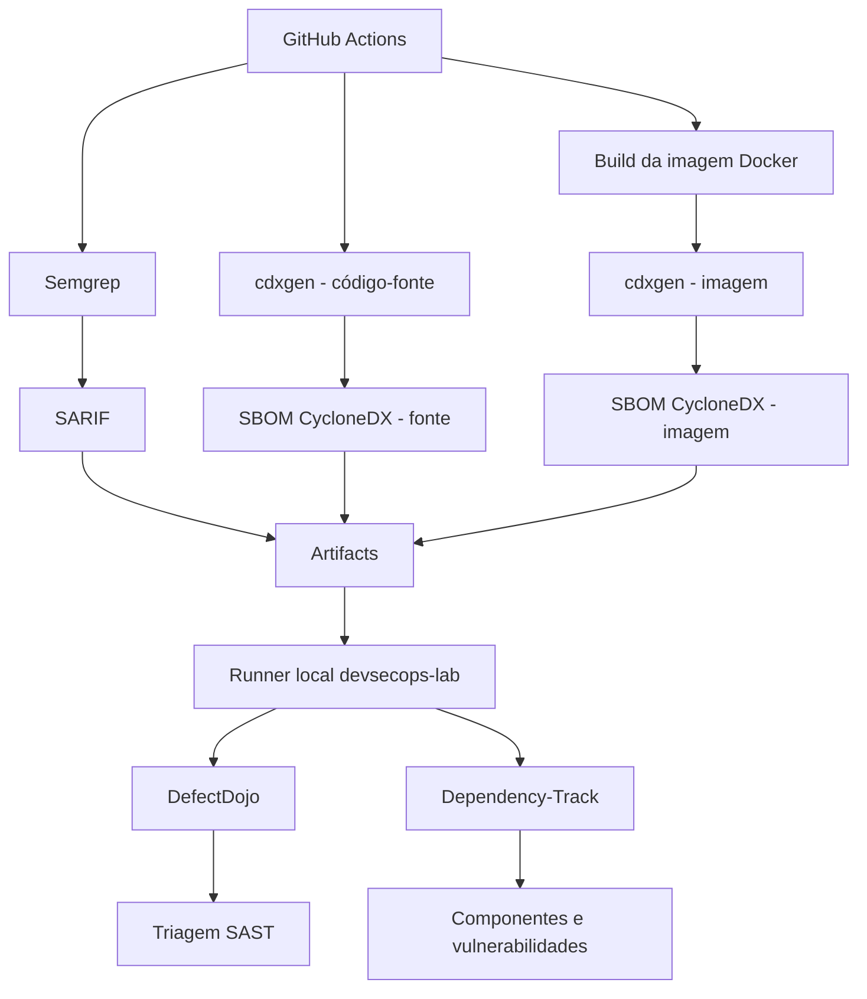

# Integração de SAST, SCA e gestão de vulnerabilidades em CI/CD

**Janderson Siqueira — Matrícula 2515965**

**Repositório:** `jandersonsiqueira/trabalho-final-unifor`
**Execução final:** GitHub Actions — Run #4 — ID `35643067274`

> **Status final:** execução completa concluída com sucesso. Os quatro jobs finalizaram com sucesso, com ingestão confirmada no DefectDojo e no Dependency-Track.

## 1. Introdução

DevSecOps incorpora verificações de segurança ao ciclo de desenvolvimento, buscando identificar vulnerabilidades de forma antecipada e transformar os resultados das ferramentas em ações de tratamento.

Neste trabalho foram aplicadas técnicas de **SAST (Static Application Security Testing)** e **SCA (Software Composition Analysis)** sobre o VAmPI, uma API intencionalmente vulnerável utilizada em ambiente acadêmico isolado.

A automação foi realizada com GitHub Actions. O Semgrep foi utilizado para análise estática e geração de resultados em SARIF, enquanto o cdxgen foi utilizado para gerar SBOMs no formato CycloneDX tanto do código-fonte quanto da imagem Docker.

Os resultados foram posteriormente integrados ao DefectDojo, para centralização e triagem dos achados SAST, e ao Dependency-Track, para inventário dos componentes e correlação com vulnerabilidades conhecidas.

## 2. Objetivo

O objetivo do trabalho foi implementar uma pipeline DevSecOps capaz de:

* executar análise estática utilizando Semgrep;
* gerar relatório SARIF;
* produzir SBOMs CycloneDX utilizando cdxgen;
* analisar separadamente o código-fonte e a imagem Docker;
* enviar os resultados SAST ao DefectDojo;
* enviar os SBOMs ao Dependency-Track;
* preservar artifacts e logs da execução;
* analisar e interpretar achados de segurança encontrados durante o processo.

Além da automação, buscou-se demonstrar que a execução bem-sucedida das ferramentas não substitui a triagem humana dos resultados.

## 3. Arquitetura da solução

Os jobs de análise são executados em runners hospedados pelo GitHub.

Como DefectDojo e Dependency-Track estão disponíveis apenas localmente, foi utilizado um **self-hosted runner** com a label `devsecops-lab`. Esse runner recupera os artifacts produzidos pelos jobs anteriores e realiza somente as integrações com as plataformas locais.

Essa separação permite que os scanners sejam executados em ambiente isolado e evita a exposição do DefectDojo e do Dependency-Track na internet.

O VAmPI foi analisado no commit:

`f16052dce83f05847133ec98f01c5193a41de7d8`

## 4. Ferramentas utilizadas

| Ferramenta                | Função                                                      |
| ------------------------- | ----------------------------------------------------------- |
| GitHub Actions            | Orquestração da pipeline, logs e artifacts                  |
| VAmPI                     | Aplicação intencionalmente vulnerável utilizada como alvo   |
| Semgrep 1.177.0           | Análise estática de segurança                               |
| SARIF 2.1.0               | Formato utilizado para transportar os resultados SAST       |
| cdxgen 12.8.4             | Geração dos SBOMs                                           |
| CycloneDX 1.6             | Formato dos SBOMs                                           |
| DefectDojo 3.3.100        | Centralização e triagem dos achados SAST                    |
| Dependency-Track 4.14.4   | Inventário e correlação de componentes com vulnerabilidades |
| Docker Compose            | Execução local das plataformas                              |
| Self-hosted GitHub Runner | Integração entre GitHub Actions e serviços locais           |

## 5. Implementação da pipeline

O workflow `.github/workflows/devsecops.yml` foi dividido em quatro jobs principais:

1. **SAST e SARIF**
2. **SCA e SBOM do fonte**
3. **SCA e SBOM da imagem**
4. **Integrações locais**

Os três primeiros jobs realizam as análises de forma independente.

O quarto job depende dos resultados anteriores, executa no self-hosted runner e recupera os artifacts para realizar os uploads ao DefectDojo e ao Dependency-Track.

Na execução final, os quatro jobs foram concluídos com sucesso:

| Job                      | Resultado |
| ------------------------ | --------- |
| 1 - SAST e SARIF         | Sucesso   |
| 2 - SCA e SBOM do fonte  | Sucesso   |
| 3 - SCA e SBOM da imagem | Sucesso   |
| 4 - Integrações locais   | Sucesso   |

A execução final corresponde à **Run #4**, ID `35643067274`, iniciada em 21/09/2026.

O commit analisado pelo workflow foi:

`f16f73d09537f3cdaedd86f2063f2741a4aecfbc`

### Evidência — pipeline completa

Inserir aqui o print enviado da tela do GitHub Actions mostrando os quatro jobs em verde.

## 6. Análise SAST com Semgrep

O Semgrep foi executado com regras automáticas do registry e geração direta de SARIF.

A execução final utilizou a versão **1.177.0**.

Os resultados foram:

| Métrica                            | Resultado         |
| ---------------------------------- | ----------------- |
| Arquivos analisados                | 22                |
| Regras executadas                  | 332               |
| Findings encontrados               | 8                 |
| Formato de saída                   | SARIF 2.1.0       |
| Findings importados no DefectDojo  | 8                 |
| Severidade observada no DefectDojo | 4 High e 4 Medium |

A existência de findings não interrompe automaticamente a geração das evidências. Entretanto, falhas reais da ferramenta, arquivos inválidos ou falhas nas integrações fazem a respectiva etapa falhar.

O relatório produzido pelo Semgrep foi armazenado como artifact da execução.

### Evidência — DefectDojo

Inserir aqui o print enviado do dashboard do DefectDojo.

O dashboard confirmou a existência de **8 findings ativos**, sendo:

* 4 High;
* 4 Medium;
* 0 fechados;
* 0 com risco aceito.

O SARIF foi importado no:

* Engagement ID: `1`
* Test ID: `1`

O log da execução final confirmou:

`DefectDojo: importacao aceita; Test 1`

A utilização de reimportação permite reutilizar o mesmo Test em execuções posteriores, evitando a criação desnecessária de novos testes para cada execução da pipeline.

### Evidência — findings

Inserir aqui o print enviado da tela **Achados em aberto**, mostrando os oito resultados importados.

## 7. Análise SCA e geração dos SBOMs

O cdxgen foi utilizado para gerar dois inventários independentes:

1. SBOM do código-fonte;
2. SBOM da imagem Docker efetivamente construída.

Essa separação é importante porque a imagem contém componentes adicionais do ambiente de execução que não necessariamente aparecem ao analisar apenas os arquivos do projeto.

### Resultado dos SBOMs

| Métrica                     |         Fonte |         Imagem |
| --------------------------- | ------------: | -------------: |
| Formato                     | CycloneDX 1.6 |  CycloneDX 1.6 |
| Componentes                 |            26 |            388 |
| Projeto no Dependency-Track | VAmPI / fonte | VAmPI / imagem |
| Critical                    |             0 |              0 |
| High                        |             9 |             11 |
| Medium                      |            14 |             26 |
| Low                         |             3 |              5 |
| Unassigned                  |             1 |              1 |
| Risk Score                  |            95 |            143 |

UUID do projeto de fonte:

`b68d1eb3-d2c3-4c45-9699-0e4b7d478f25`

UUID do projeto da imagem:

`e91927db-1fa1-4bc1-a6b8-010bf4b81480`

O SBOM de fonte apresentou **26 componentes**, enquanto o SBOM da imagem apresentou **388 componentes**.

Essa diferença demonstra a importância de analisar também o artefato que será executado, pois a imagem inclui bibliotecas, arquivos, frameworks e outros componentes provenientes do ambiente base.

A quantidade de componentes não corresponde à quantidade de vulnerabilidades. O cdxgen realiza o inventário; a correlação com vulnerabilidades conhecidas é responsabilidade do Dependency-Track.

## 8. Integração com DefectDojo

O SARIF produzido pelo Semgrep foi enviado automaticamente ao DefectDojo pelo job de integrações locais.

A integração foi projetada para utilizar `import-scan` na primeira importação e `reimport-scan` nas execuções seguintes.

Na execução final foram confirmados:

| Item            | Resultado |
| --------------- | --------- |
| Engagement      | 1         |
| Test            | 1         |
| Findings ativos | 8         |
| High            | 4         |
| Medium          | 4         |
| Upload          | Sucesso   |

A ferramenta permite centralizar os findings encontrados pelo scanner e posteriormente registrar decisões de triagem, responsáveis, correções e aceitação de risco.

## 9. Integração com Dependency-Track

Os dois SBOMs foram enviados ao Dependency-Track.

Após cada upload, o cliente aguardou o processamento e verificou a presença dos componentes no respectivo projeto.

O log da execução confirmou que ambos foram aceitos:

`Dependency-Track: SBOM aceito; processamento encerrado e componentes presentes.`

A análise das vulnerabilidades ocorre de maneira assíncrona após a ingestão do SBOM.

### 9.1 Projeto VAmPI / fonte

Último BOM Import observado:

**21/09/2026 às 16:14:28**

Última análise de vulnerabilidades:

**21/09/2026 às 16:14:29**

Resultado:

| Severidade | Quantidade |
| ---------- | ---------: |
| Critical   |          0 |
| High       |          9 |
| Medium     |         14 |
| Low        |          3 |
| Unassigned |          1 |

**Risk Score: 95**

Inserir aqui o print enviado da tela **Project Vulnerabilities — VAmPI / fonte**.

### 9.2 Projeto VAmPI / imagem

Último BOM Import observado:

**21/09/2026 às 16:14:34**

Última análise de vulnerabilidades:

**21/09/2026 às 16:14:35**

Resultado:

| Severidade | Quantidade |
| ---------- | ---------: |
| Critical   |          0 |
| High       |         11 |
| Medium     |         26 |
| Low        |          5 |
| Unassigned |          1 |

**Risk Score: 143**

Inserir aqui o print enviado da tela **Project Vulnerabilities — VAmPI / imagem**.

O projeto referente à imagem apresentou maior quantidade de componentes e maior Risk Score que o projeto de fonte. Isso é compatível com a maior superfície de componentes inventariados na imagem, embora a quantidade isolada de componentes não determine, por si só, a explorabilidade das vulnerabilidades.

## 10. Evidências da execução

As principais evidências coletadas durante a execução foram:

| Evidência               | Resultado observado                      |
| ----------------------- | ---------------------------------------- |
| GitHub Actions          | Quatro jobs concluídos com sucesso       |
| Semgrep                 | 332 regras, 22 arquivos e 8 findings     |
| SARIF                   | Documento SARIF 2.1.0 válido             |
| SBOM do fonte           | CycloneDX 1.6 com 26 componentes         |
| SBOM da imagem          | CycloneDX 1.6 com 388 componentes        |
| DefectDojo              | 8 findings: 4 High e 4 Medium            |
| Dependency-Track fonte  | 9 High, 14 Medium, 3 Low e 1 Unassigned  |
| Dependency-Track imagem | 11 High, 26 Medium, 5 Low e 1 Unassigned |
| Integrações             | Uploads concluídos com sucesso           |

Além dos prints dos dashboards, a pipeline preserva os relatórios e recibos de integração como artifacts do GitHub Actions.

## 11. Análise dos principais achados

### 11.1 Política de tratamento proposta

Para fins deste exercício, foi considerada a seguinte proposta de SLA para tratamento:

| Severidade | Prazo proposto          |
| ---------- | ----------------------- |
| Critical   | imediato / até 24 horas |
| High       | até 7 dias              |
| Medium     | até 30 dias             |
| Low        | até 90 dias             |

Os prazos são uma proposta utilizada para demonstrar o processo de gestão de vulnerabilidades e não representam necessariamente uma política institucional existente.

### 11.2 Achado 1 — Chave de assinatura fixa

| Campo                           | Análise                                                                                                            |
| ------------------------------- | ------------------------------------------------------------------------------------------------------------------ |
| Ferramenta                      | Semgrep                                                                                                            |
| Finding                         | `Hardcoded Variable SECRET_KEY Detected`                                                                           |
| Severidade no DefectDojo        | High                                                                                                               |
| Evidência                       | Valor sensível definido diretamente na configuração da aplicação                                                   |
| CWE reportado                   | CWE-489                                                                                                            |
| Confiança indicada pelo scanner | Low confidence                                                                                                     |
| Triagem                         | O código deve ser revisado no contexto de utilização da chave; no VAmPI ela é consumida pelo fluxo de autenticação |
| Risco                           | Uma chave criptográfica conhecida pode comprometer mecanismos que dependem da confidencialidade dessa chave        |
| Correção                        | Remover o segredo do código, utilizar variável de ambiente ou gerenciador de segredos e realizar rotação           |
| Responsável proposto            | Time responsável pela aplicação                                                                                    |
| Prazo proposto                  | Até 7 dias após confirmação                                                                                        |

O achado é particularmente relevante porque valores secretos não devem permanecer versionados junto ao código-fonte.

A correção adequada consiste em externalizar o segredo, utilizar um valor forte e aleatório e impedir que credenciais reais sejam armazenadas no repositório.

### 11.3 Achado 2 — Container sem usuário não privilegiado

| Campo                    | Análise                                                                                 |
| ------------------------ | --------------------------------------------------------------------------------------- |
| Ferramenta               | Semgrep                                                                                 |
| Finding                  | `By Not Specifying a USER, a Program in the Container May Run with Elevated Privileges` |
| Severidade no DefectDojo | High                                                                                    |
| CWE                      | CWE-250 / CWE-269, conforme as ocorrências reportadas                                   |
| Evidência                | O estágio final do Dockerfile não declara um `USER` não privilegiado                    |
| Triagem                  | Verdadeiro positivo de configuração                                                     |
| Risco                    | A aplicação pode executar com privilégios desnecessários dentro do container            |
| Correção                 | Criar usuário e grupo dedicados, ajustar permissões e declarar `USER` no estágio final  |
| Responsável proposto     | Time da aplicação em conjunto com plataforma                                            |
| Prazo proposto           | Até 7 dias enquanto classificado como High                                              |

O achado não significa que foi demonstrado um escape do container. Ele identifica uma configuração que aumenta o impacto potencial caso a aplicação seja comprometida.

A utilização de um usuário dedicado aplica o princípio do menor privilégio e reduz a superfície de impacto dentro do ambiente do container.

### 11.4 Achado 3 — JWT detectado no código/especificação

| Campo                           | Análise                                                                                                                                      |
| ------------------------------- | -------------------------------------------------------------------------------------------------------------------------------------------- |
| Ferramenta                      | Semgrep                                                                                                                                      |
| Finding                         | `JWT Token Detected`                                                                                                                         |
| Severidade no DefectDojo        | High                                                                                                                                         |
| CWE reportado                   | CWE-321                                                                                                                                      |
| Confiança indicada pelo scanner | Low confidence                                                                                                                               |
| Triagem                         | Requer validação antes de ser classificado como credencial ativa                                                                             |
| Risco                           | Caso o token seja válido e reutilizável, sua exposição pode permitir uso indevido                                                            |
| Correção                        | Verificar origem e validade do token; revogar caso esteja ativo; remover valores reais do repositório e utilizar dados fictícios em exemplos |
| Responsável proposto            | Time responsável pela aplicação                                                                                                              |
| Prazo proposto                  | Validação imediata; até 7 dias para correção caso confirmado                                                                                 |

Esse finding demonstra a importância da triagem humana.

A simples detecção de uma sequência com formato de JWT não é suficiente para afirmar que existe uma credencial ativa exposta. É necessário verificar sua origem, finalidade, validade e possibilidade de reutilização.

Caso seja apenas um valor fictício utilizado como exemplo, o finding poderá ser classificado como falso positivo ou risco aceito conforme a política adotada. Caso seja um token válido, deve ser revogado e removido imediatamente.

## 12. Limitações da análise

A aplicação utilizada no exercício é propositalmente vulnerável.

Os resultados de SAST representam padrões encontrados pelo scanner e não demonstram, isoladamente, exploração prática.

Da mesma forma, a presença de uma vulnerabilidade associada a determinado componente pelo SCA não significa automaticamente que ela seja explorável no contexto específico da aplicação.

A análise depende de fatores como:

* caminho de execução;
* configuração;
* exposição do componente;
* versão efetivamente utilizada;
* disponibilidade de correção;
* contexto operacional.

Por esse motivo, os resultados automatizados devem passar por triagem humana.

DAST e testes específicos de lógica de negócio não fazem parte do escopo desta entrega.

## 13. Conclusão

A implementação permitiu integrar diferentes etapas de segurança a uma pipeline CI/CD utilizando ferramentas específicas para SAST, SCA, inventário de componentes e gestão de vulnerabilidades.

Na execução final, os quatro jobs do GitHub Actions foram concluídos com sucesso.

O Semgrep analisou 22 arquivos utilizando 332 regras e produziu 8 findings. O relatório SARIF foi importado no DefectDojo, que apresentou 4 achados High e 4 Medium.

O cdxgen produziu dois SBOMs CycloneDX 1.6: um com 26 componentes referentes ao código-fonte e outro com 388 componentes referentes à imagem Docker.

Os dois documentos foram processados pelo Dependency-Track. O projeto de fonte apresentou Risk Score 95, enquanto o projeto da imagem apresentou Risk Score 143.

A utilização de um self-hosted runner permitiu integrar uma pipeline executada no GitHub com serviços disponíveis apenas no ambiente local, sem necessidade de expor DefectDojo ou Dependency-Track publicamente.

O principal aprendizado da atividade é que uma pipeline verde comprova que os controles configurados foram executados corretamente, mas não significa que a aplicação esteja segura. Os scanners produzem informações que ainda precisam ser analisadas, contextualizadas, priorizadas e transformadas em ações de correção.

Como evolução do projeto, poderiam ser adicionados testes DAST, políticas automáticas de bloqueio de release, acompanhamento formal dos SLAs de correção e integração com sistemas de gestão de chamados.

## Referências

* HENRIQUE, Cristiano. *DevSecOps — Segurança Integrada ao Ciclo de Desenvolvimento*. Material da disciplina.
* Documentação oficial do Semgrep.
* Documentação oficial do CycloneDX/cdxgen.
* Documentação oficial do DefectDojo.
* Documentação oficial do Dependency-Track.
* Repositório oficial do VAmPI.
* SARIF, SBOMs, logs e recibos produzidos pela GitHub Actions Run #4.
