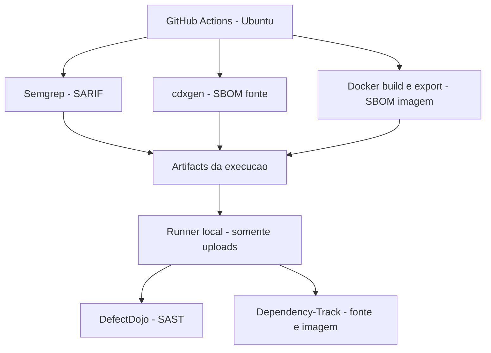

# Integracao de SAST, SCA e gestao de vulnerabilidades em CI/CD

**Instituicao:** Universidade de Fortaleza (UNIFOR)  
**Curso:** [PREENCHER POS-GRADUACAO]  
**Disciplina:** DevSecOps  
**Professor:** Cristiano Henrique  
**Aluno(a):** [PREENCHER NOME E MATRICULA]  
**Data da entrega:** [PREENCHER]  
**Repositorio:** https://github.com/jandersonsiqueira/trabalho-final-unifor  
**Execucao GitHub Actions:** [INSERIR URL E RUN ID]

> Status: validacao local concluida em 19/09/2026. Execucao completa no GitHub Actions e capturas dos paineis pendentes.

## 1. Introducao

DevSecOps incorpora verificacoes de seguranca ao desenvolvimento e transforma seus resultados em trabalho com responsavel e prazo. SAST examina o codigo e configuracoes; SCA inventaria componentes de terceiros e correlaciona suas versoes com bases de vulnerabilidades. Este trabalho aplica essas tecnicas ao VAmPI, uma API intencionalmente vulneravel, em ambiente academico isolado.

A orquestracao utiliza GitHub Actions, com workflow versionado junto aos scripts de analise e integracao. O escopo abrange analise estatica, inventario de dependencias e gestao dos achados. Testes dinamicos ficam como evolucao do projeto.

## 2. Objetivo

Implementar uma pipeline que execute Semgrep, produza SARIF, gere SBOMs CycloneDX com cdxgen e envie os resultados ao DefectDojo e ao Dependency-Track. Demonstrar tanto a execucao quanto a interpretacao dos achados, incluindo classificacao, evidencia, CWE/CVE, responsavel e prazo.

## 3. Arquitetura da solucao

O runner do GitHub nao acessa diretamente o localhost do aluno. Um runner local recebe os artifacts e chama as APIs dos servicos Docker no mesmo host. Os servicos escutam apenas em loopback; nao foi necessario publica-los na internet. O VAmPI nao e iniciado para estas analises. A imagem e exportada para arquivo e inspecionada sem compartilhar o socket Docker com o scanner.

Credenciais sao geradas localmente e excluidas do versionamento pelo `.gitignore`; os uploads do CI usam GitHub Secrets. URLs e IDs usam Variables. No repositorio publico, o runner local e temporario (`--ephemeral`), acionado manualmente na branch padrao e encerrado apos o job. Nao ha gatilho de pull request para esse runner.

## 4. Ferramentas utilizadas

| Ferramenta | Funcao |
| --- | --- |
| GitHub Actions | Orquestracao, logs por etapa e artifacts |
| VAmPI | Alvo no commit `f16052dce83f05847133ec98f01c5193a41de7d8` |
| Semgrep 1.177.0 | Analise estatica com regras automaticas e SARIF 2.1.0 |
| cdxgen 12.8.4 | Inventario do fonte e da imagem em CycloneDX 1.6 |
| DefectDojo 3.3.100 | Importacao, deduplicacao e triagem de achados SAST |
| Dependency-Track 4.14.4 | Inventario e correlacao continua com vulnerabilidades |
| Docker Compose | Plataformas locais com persistencia |

## 5. Implementacao da pipeline

O workflow `.github/workflows/devsecops.yml` define tres jobs de coleta e um de integracao. Os passos de checkout, preparacao das ferramentas, SAST, geracao/validacao do SARIF, SCA, geracao/validacao dos SBOMs, uploads e armazenamento ficam visiveis no Actions.

Os scans usam o mesmo commit do VAmPI. O Semgrep gera SARIF diretamente durante a analise; a etapa seguinte verifica sua estrutura e erros de execucao. A deteccao de findings permite continuar a coleta. Erros de ferramenta, arquivos invalidos e erros HTTP fazem a etapa falhar.

Artifacts disponiveis sao preservados mesmo em falha. Os uploads sao independentes: uma indisponibilidade do DefectDojo nao impede a tentativa no Dependency-Track. A politica academica de severidade orienta a triagem, mas nao esta implementada como gate de release.

[INSERIR PRINT DA PIPELINE]

[INSERIR PRINT DOS PASSOS E LOGS]

## 6. Analise SAST com Semgrep

Foi utilizado `semgrep scan --config=auto --sarif`, com regras do registry, sem `--error` e com `--strict`. A versao testada exige metricas para o modo automatico. O conjunto remoto de regras pode mudar; a reproducao deve preservar o SARIF e os logs da execucao escolhida.

Na validacao local de 19/09/2026, o Semgrep analisou 22 arquivos, executou 332 regras e registrou 8 resultados, distribuidos entre codigo Python, Dockerfile, workflow e especificacao OpenAPI. Alguns resultados compartilham a mesma causa raiz e devem ser agrupados durante a triagem.

| Medida da execucao final no Actions | Resultado |
| --- | --- |
| Data, URL e run ID | [PREENCHER] |
| Regras e arquivos analisados | [PREENCHER COM LOG REAL] |
| Findings brutos | [PREENCHER COM SARIF REAL] |
| Distribuicao de severidade | [PREENCHER; INFORMAR CRITERIO] |
| Verdadeiros/falsos positivos apos triagem | [PREENCHER] |

[INSERIR PRINT DO SEMGREP E SARIF]

## 7. Analise SCA e geracao do SBOM

O `sbom.json` descreve o projeto Python a partir do fonte e da resolucao de dependencias. O `sbom-image.json` descreve a imagem efetivamente construida e inclui pacotes do sistema operacional. O identificador da imagem fica em `image-id.txt`. Os inventarios sao enviados a projetos/versoes diferentes no Dependency-Track para permitir comparacao.

Na validacao local foram obtidos 26 componentes no fonte e 388 na imagem: 92 bibliotecas, 289 arquivos, 3 frameworks e 4 aplicacoes. O cdxgen produziu tambem 124 ativos criptograficos, excluidos do inventario final por incompatibilidade do classificador com o Dependency-Track 4.14. O SBOM do fonte inclui uma declaracao sem versao e uma ocorrencia resolvida de `swagger-ui-bundle`. O grafo de dependencias apresentou aviso sobre a raiz, limitando a classificacao automatica de relacoes diretas e transitivas.

O cdxgen gera o inventario. O Dependency-Track correlaciona as versoes dos componentes com as bases de vulnerabilidades; por isso, a contagem de componentes e registrada separadamente da contagem de CVEs.

| Medida | Fonte | Imagem |
| --- | --- | --- |
| Componentes | [INSERIR CONTAGEM REAL] | [INSERIR CONTAGEM REAL] |
| UUID do projeto | [PREENCHER] | [PREENCHER] |
| Vulnerabilidades por severidade | [PREENCHER APOS SINCRONIZACAO] | [PREENCHER APOS SINCRONIZACAO] |
| Data e fontes de vulnerabilidade | [PREENCHER] | [PREENCHER] |

[INSERIR PRINT DO CDXGEN E DOS DOIS SBOMS]

**Priorizacao SCA:** [SELECIONAR COMPONENTE REAL; COMPARAR SEVERIDADE, DEPENDENCIA DIRETA/TRANSITIVA, CORRECAO DISPONIVEL E USO NO VAMPI]. Registrar a fonte do advisory e justificar atualizar, substituir, mitigar ou aceitar. Nao inferir explorabilidade apenas por CVSS.

## 8. Integracao com DefectDojo

O SARIF e enviado ao endpoint `import-scan` na primeira execucao e a `reimport-scan` nas seguintes, com tipo `SARIF`, Engagement identificado e titulo de Test estavel. A reimportacao usa o ID do Test e permite acompanhar execucoes recorrentes. Os achados entram ativos, sem verificacao humana automatica e sem fechamento automatico dos anteriores.

Validacao local: Product `VAmPI`, Engagement ID `1`, Test ID `1`, 8 findings importados (4 High e 4 Medium), ativos e nao verificados. A segunda importacao confirmou o mesmo Test ID. Esses dados sao do laboratorio local.

Product/Engagement/Test da execucao final: [CONFIRMAR IDS NOS LOGS DO ACTIONS]  
Findings importados / deduplicados na execucao final: [INSERIR DADOS REAIS]

[INSERIR PRINT DO DEFECTDOJO]

[INSERIR PRINT DOS FINDINGS E ESTADOS DE TRIAGEM]

A reimportacao confirmou a reutilizacao do Test. A avaliacao de tendencia depende de novas execucoes e do acompanhamento dos estados de triagem.

## 9. Integracao com Dependency-Track

O cliente envia cada SBOM, acompanha o token de processamento e verifica componentes no projeto. A analise contra fontes externas e assincrona. Foram configurados projetos separados para fonte e imagem, com uma API Key restrita a upload e leitura do portfolio.

Fontes habilitadas e estado da sincronizacao: [INSERIR CONFIGURACAO REAL]  
Data da ultima analise: [INSERIR]  
Comprovantes de ingestao: [INSERIR REFERENCIA AOS LOGS]

[INSERIR PRINT DO DEPENDENCY-TRACK]

[INSERIR PRINT DOS COMPONENTES E VULNERABILIDADES]

## 10. Evidencias da execucao

| Evidencia | Arquivo / referencia |
| --- | --- |
| Pipeline completa no GitHub Actions | [INSERIR PRINT DA PIPELINE] |
| Checkout e ferramentas | [INSERIR PRINT COM SHA E VERSOES] |
| Semgrep e SARIF | [INSERIR PRINT E ARTIFACT] |
| cdxgen fonte e imagem | [INSERIR PRINTS E ARTIFACTS] |
| Uploads das duas plataformas | [INSERIR LOGS] |
| DefectDojo: dashboard, Test e findings | [INSERIR PRINT DO DEFECTDOJO] |
| Dependency-Track: dashboard, projetos e componentes | [INSERIR PRINT DO DEPENDENCY-TRACK] |
| Detalhes dos tres achados | [INSERIR PRINTS E REFERENCIAS] |
| Logs completos | [INSERIR CAMINHO DO ZIP BAIXADO DO ACTIONS] |

## 11. Analise dos principais achados

### 11.1 Politica de tratamento

Para este trabalho: criticos exigem mitigacao imediata e correcao em ate 24h; altos, 7 dias; medios, 30 dias; baixos, proximo toque com limite de 90 dias. Os prazos contam da confirmacao da triagem. Criticos bloqueiam release em uma politica de producao, mas este laboratorio nao realiza deploy. Responsavel tecnico e aprovador de risco sao papeis distintos. Aceitacoes exigem justificativa, aprovador e reavaliacao em ate 30 dias.

### 11.2 Achado 1 - Chave de assinatura fixa

| Campo | Analise do scan local |
| --- | --- |
| Ferramenta | Semgrep 1.177.0 |
| Vulnerabilidade | Chave criptografica fixa na configuracao Flask |
| Regra | `python.flask.security.audit.hardcoded-config.avoid_hardcoded_config_SECRET_KEY` |
| Descricao | O codigo define uma chave constante em `config.py`; `models/user_model.py` usa essa configuracao para assinar e verificar JWTs HS256. Quem conhece a chave pode produzir assinaturas validas. |
| Evidencia | `config.py:13`, uso em `models/user_model.py:39` e `:48`; `reports/semgrep.sarif`; finding local Dojo ID 7. [INSERIR PRINT DO FINDING REAL NO ACTIONS/DOJO] |
| CWE/CVE | O SARIF associa CWE-489. A revisao do mecanismo indica CWE-321 (chave criptografica fixa), tambem relacionada a CWE-798. Nao foi identificada uma CVE especifica para esse achado. |
| Severidade | SARIF `error`, Dojo local High; proposta humana: Alta pelo papel da chave na autenticacao. Confirmar contexto de exposicao. |
| Verdadeiro ou falso positivo | Verdadeiro positivo por revisao do fluxo de assinatura; nao foi realizada exploracao dinamica. |
| Justificativa | O valor nao e apenas exemplo documental: e lido pela rotina de autenticacao. |
| Possivel correcao | Segredo aleatorio externo ao codigo, com rotacao, invalidacao dos tokens anteriores e protecao da configuracao. |
| Responsavel | Time da aplicacao; [INSERIR NOME]. |
| Prazo | Ate 7 dias da confirmacao; [INSERIR DATA DE CONFIRMACAO E VENCIMENTO]. |

### 11.3 Achado 2 - Container sem usuario restrito

| Campo | Analise do scan local |
| --- | --- |
| Ferramenta | Semgrep 1.177.0 |
| Vulnerabilidade | Execucao da aplicacao com privilegios desnecessarios no container |
| Regra | `dockerfile.security.missing-user.missing-user` |
| Descricao | O estagio final do Dockerfile nao declara `USER` nao privilegiado antes de iniciar a aplicacao. |
| Evidencia | `Dockerfile:17`, `reports/semgrep.sarif`, finding local Dojo ID 6; `docker image inspect` confirmou `Config.User` vazio. Revisar tambem a linha 16, da mesma causa raiz. [INSERIR PRINT DO FINDING REAL] |
| CWE/CVE | CWE-250 na regra principal; a regra da linha 16 associa CWE-269. Nao ha CVE especifica para essa configuracao. |
| Severidade | SARIF `error`, Dojo local High; proposta humana: Media em container isolado, sujeita a elevacao conforme privilegios e exposicao. A reducao proposta exige aprovacao na triagem; nao foi aplicada no Dojo. |
| Verdadeiro ou falso positivo | Verdadeiro positivo de configuracao por revisao do Dockerfile; nao demonstra escape de container. |
| Justificativa | O Dockerfile usa uma base Python sem trocar de usuario no estagio final. Comprometimento da aplicacao pode ter impacto maior dentro do container. |
| Possivel correcao | Criar usuario/grupo dedicado, ajustar permissoes dos arquivos e declarar `USER` no estagio final. Validar escrita no SQLite e inicializacao da aplicacao. |
| Responsavel | Plataforma em conjunto com time da aplicacao; [INSERIR NOME]. |
| Prazo | Ate 7 dias enquanto mantido High; 30 dias apenas se a reclassificacao para Media for aprovada. [INSERIR DATA DE CONFIRMACAO E VENCIMENTO]. |

### 11.4 Achado 3 - Actions referenciadas por tags mutaveis

| Campo | Analise do scan local |
| --- | --- |
| Ferramenta | Semgrep 1.177.0 |
| Vulnerabilidade | Dependencia de CI sem fixacao por commit |
| Regra | `yaml.github-actions.security.github-actions-mutable-action-tag.github-actions-mutable-action-tag` |
| Descricao | O workflow original do VAmPI usa referencias como `docker/setup-qemu-action@v2`, que podem apontar para outro codigo sem mudanca no workflow consumidor. |
| Evidencia | `.github/workflows/docker-image.yml:16`, finding local Dojo ID 1, com ocorrencias adicionais nas linhas 19, 22 e 28. [INSERIR PRINT DO FINDING REAL] |
| CWE/CVE | CWE-1357 e CWE-353 reportadas pelo scanner. Nao implica ocorrencia de ataque nem uma CVE concreta. |
| Severidade | SARIF `warning`; proposta humana: Media, conforme acessos concedidos ao workflow. |
| Verdadeiro ou falso positivo | Verdadeiro positivo de integridade/configuracao; exploracao nao demonstrada. |
| Justificativa | As referencias identificam tags, nao commits imutaveis. As quatro ocorrencias compartilham o mesmo tipo de risco. |
| Possivel correcao | Fixar actions em SHA completo revisado, com atualizacoes controladas. O workflow deste trabalho ja utiliza SHAs. |
| Responsavel | Responsavel pela pipeline/plataforma; [INSERIR NOME]. |
| Prazo | Ate 30 dias da confirmacao; [INSERIR DATA DE CONFIRMACAO E VENCIMENTO]. |

Os tres achados foram selecionados do SARIF da execucao local. Outro resultado, referente a um JWT na especificacao OpenAPI, requer verificacao da validade e do uso do token antes de ser classificado como vazamento de credencial ativa.

### 11.5 Limites da analise

As severidades humanas sao propostas justificadas, distintas dos niveis SARIF. A aplicacao e propositalmente vulneravel e foi preservada para o exercicio. SAST nao prova exploracao e pode deixar falhas sem detectar. A ausencia de achado sobre um trecho nao demonstra seguranca. SCA depende de inventario completo, versoes resolvidas e bases sincronizadas. DAST e logica de negocio nao foram avaliados nesta entrega.

## 12. Conclusao

A implementacao combina coleta automatizada, inventario de componentes e gestao dos resultados, com identificacao clara das etapas e preservacao de evidencias. A escolha de runners separados resolve o acesso aos servicos locais e limita a disponibilizacao de chaves aos uploads.

[COMPLETAR APOS A EXECUCAO NO GITHUB: RESULTADO DOS QUATRO JOBS, CONFIRMACAO DE INGESTAO NAS PLATAFORMAS E PRINCIPAL APRENDIZADO DA TRIAGEM.]

Como evolucao, podem ser incluidos ZAP, lockfiles e digests para maior reprodutibilidade, gate de release apos a fase de coleta, chamados com responsavel e acompanhamento dos prazos. Uma pipeline verde confirma execucao dos controles configurados; nao equivale a uma aplicacao segura.

## Referencias

- HENRIQUE, Cristiano. *DevSecOps - Seguranca Integrada ao Ciclo de Desenvolvimento*. Material da disciplina, UNIFOR.
- Repositorio oficial do VAmPI e documentacoes oficiais listadas no README.
- SARIF, SBOMs, logs e recibos: [INSERIR LINK PARA ARTIFACTS DA EXECUCAO FINAL].
